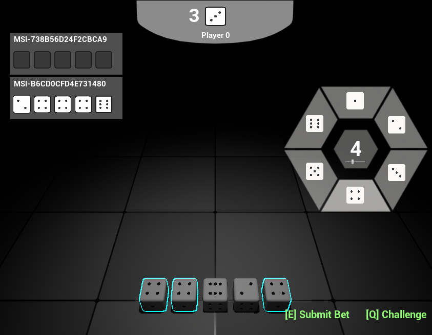

# Multiplayer Liar's Dice Game (Unreal Engine)

## Overview

This project is a **multiplayer dice game prototype built in Unreal Engine using C++**.
It was created as a **personal learning project and portfolio piece** to explore Unreal Engine’s multiplayer framework, gameplay systems, animations, and UI architecture.

The project focuses primarily on **networked gameplay logic and UI synchronization**, rather than on creating a fully polished or production-ready game.

The game itself is inspired by classic **dice bluffing games** like Liar's Dice, where players roll hidden dice and make bets about the total dice values across all players.

## Notes

Future improvements could include:

* Lobby and matchmaking systems
* Improved UI and visual polish
* Better animations and visual effects
* Additional gameplay rules: additional betting (e.g. wildcards), challenge exact value (if correct, get additional dice), try outs (when one dice left)
